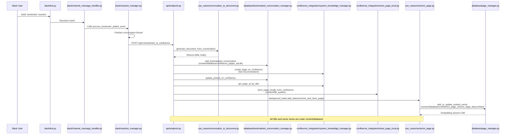

# :bookmark: Event to Vector DB Flow Documentation

## Overview
This document details the end-to-end process that occurs when a :bookmark: reaction is added in Slack, tracing the flow through the system, including all relevant file paths, databases, and vector DBs.

---

## 1. Project Structure and Key Paths

| Purpose | Variable | Path (relative to project root) |
|---------|----------|---------------------------------|
| **Main SQL DB** (Confluence pages, embeddings, etc.) | `sql_file_path` | `content/database/confluence_pages_sql.db` |
| **Vector DB (Chroma, persistent client)** | `vector_folder_path` | `content/database/confluence_page_vectors` |
| **Vector Chunks** | `vector_chunk_folder_path` | `content/database/confluence_page_vectors` |
| **Interaction Vectors** | `interactions_folder_path` | `content/database/confluence_interaction_vectors` |
| **File System Storage** | `file_system_path` | `content/file_system` |
| **Charts** | `chart_folder_path` | `content/charts` |

---

## 2. End-to-End :bookmark: Event Flow

### Step-by-Step Sequence

1. **Slack User adds :bookmark: reaction**
   - **File:** `slack/bot.py`, `slack/channel_message_handler.py`
   - **Handler:** `ChannelMessageHandler.handle` detects the event and calls `process_bookmark_added_event`.

2. **Process :bookmark: Event**
   - **File:** `slack/reaction_manager.py`
   - Fetches the conversation thread and POSTs it to `/api/v1/bookmark_to_confluence`.

3. **API Receives and Processes Event**
   - **File:** `api/endpoint.py`
   - Generates a document from the conversation, stores it in the DB, creates a Confluence page, and schedules vectorization.

4. **Bookmarked Conversation Storage**
   - **File:** `database/bookmarked_conversation_manager.py`
   - **DB Table:** `bookmarked_conversations` in `content/database/confluence_pages_sql.db`

5. **Confluence Page Storage**
   - **File:** `confluence_integration/store_page_local.py`
   - **Local Copy:** `content/file_system`
   - **DB Table:** `page_data` in `content/database/confluence_pages_sql.db`

6. **Vectorization and Storage**
   - **File:** `use_cases/vectorize_page.py`, `database/page_manager.py`
   - **Vector DB Path:** `content/database/confluence_page_vectors`
   - **DB Table:** `page_data.embed` (embedding stored as JSON string)

---

## 3. Mermaid Diagram

---

## 4. Potential Failure Points

- Slack event not triggered or not handled
- No messages fetched for the thread
- API call to `/api/v1/bookmark_to_confluence` fails
- Document generation or DB write fails
- Confluence page or vectorization fails
- Background task fails silently (embedding not written)

---

## 5. References
- All configuration values are set in `configuration.py`.
- All DBs and vector DBs are under `content/database/` relative to the project root.
- Local Confluence page copies are under `content/file_system`.

---

**For troubleshooting, check logs and DB entries at each step and verify the presence of files and embeddings at the specified paths.** 